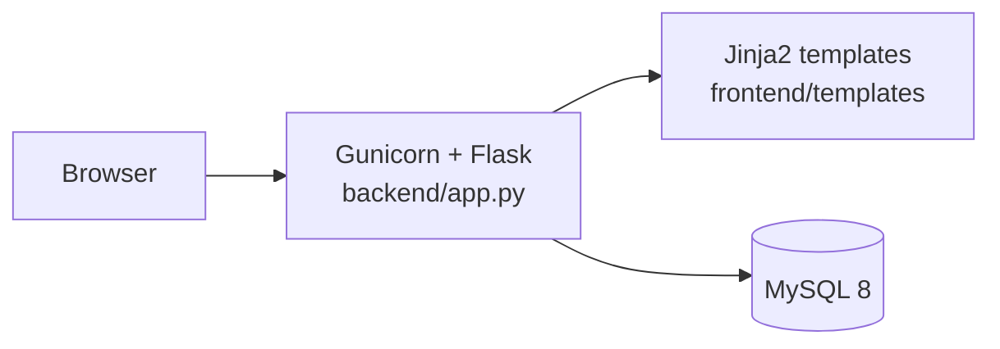

# CareerCompass

A career-path quiz: 15 questions scored across five career tracks, with user accounts, saved results and a one-command Docker setup. Built with Flask, MySQL and Docker.


<p>
  
  
  
</p>

## What this demonstrates

- An application and its database defined together as containers, served by a production WSGI server with a health endpoint
- Session authentication with hashed passwords rather than credentials in plain text
- Deployment driven from CI over SSH, with configuration supplied by the environment

## Features

- **Career matching:** 15 questions on personality, skills and interests. Each answer adds points to one or more career tracks, and the highest-scoring track is the recommendation.
- **Interactive quiz:** animated interface with keyboard navigation
- **Results breakdown:** a percentage for each of the five tracks
- **Accounts:** registration and login with Werkzeug password hashing and Flask-Login sessions
- **Persistence:** results saved to MySQL
- **Containerised:** Docker Compose runs the app and database together; Gunicorn serves the app, configuration comes from the environment, and `/health` reports status
- **Responsive:** works on desktop, tablet and mobile

### Career tracks

Software Engineer · Data Scientist · UX/UI Designer · Product Manager · Cybersecurity Specialist

Each track can score up to 45 points across the 15 questions; results are shown as percentages, capped at 99%.

## Architecture



## Quick start

**Prerequisite:** Docker Desktop, or Docker Engine with the Compose plugin.

```bash
cp .env.example .env      # then set SECRET_KEY and the database passwords
docker compose up --build
```

Open http://localhost:5000.

## Routes

| URL | Purpose | Sign-in required |
|---|---|---|
| `/` | Landing page | No |
| `/register` | Create an account | No |
| `/login` | Sign in | No |
| `/quiz` | Take the quiz | Yes |
| `/result` | View results | Yes |
| `/logout` | Sign out | Yes |
| `/health` | Health check (JSON) | No |

## Tech stack

| Layer | Technology |
|---|---|
| Frontend | HTML5, CSS3, vanilla JavaScript, Jinja2 |
| Backend | Python 3.11, Flask 3.0.3, Flask-Login |
| ORM | Flask-SQLAlchemy 3.1.1 |
| Database | MySQL 8.0 |
| Server | Gunicorn 22.0.0 |
| Containers | Docker, Docker Compose |
| Deployment | GitHub Actions to AWS EC2 |

## Configuration

All settings come from `.env` (template: `.env.example`):

| Variable | Purpose |
|---|---|
| `FLASK_ENV`, `APP_ENV` | `development` or `production` |
| `SECRET_KEY` | Session signing key; use 32 or more random bytes |
| `MYSQL_ROOT_PASSWORD` | MySQL root password for the database container |
| `DB_HOST`, `DB_PORT`, `DB_NAME`, `DB_USER`, `DB_PASSWORD` | Application database connection |
| `GUNICORN_WORKERS`, `GUNICORN_TIMEOUT` | Gunicorn tuning |
| `PORT` | Port the app listens on |

Never commit `.env`: it holds your secret key and database passwords.

## Local development without Docker

Requires a running MySQL server.

```bash
cd backend
python -m venv venv
source venv/bin/activate        # Windows: venv\Scripts\activate
pip install -r requirements.txt
export FLASK_APP=app.py FLASK_ENV=development
python app.py
```

## Database access

The MySQL container is published on host port `3307`, for tools such as MySQL Workbench.

```bash
docker exec -it careercompass-db mysql -u <DB_USER> -p -D <DB_NAME>
```

```sql
SELECT id, name, email, predicted_career, created_at FROM users;
```

## Docker commands

```bash
docker compose up --build     # rebuild and start
docker compose logs -f        # follow logs
docker compose down           # stop
docker compose down -v        # stop and delete the database volume
docker exec -it careercompass-web bash
```

## Troubleshooting

| Problem | Fix |
|---|---|
| Port 5000 already in use | Change the mapping in `docker-compose.yml` to `"8000:5000"` and open http://localhost:8000 |
| Database connection failed | `docker compose down -v && docker compose up --build` resets the stack |
| MySQL container exited | Check `docker compose logs db` |

## Deployment

`.github/workflows/deploy.yml` runs on every push to `main`. It connects to an EC2 host over SSH, syncs the `stealthcoderX/fullstack-careercompass` repository into `/home/ubuntu/careercompass`, and rebuilds the containers with Docker Compose.

Repository secrets: `EC2_HOST` and `EC2_SSH_KEY`.

> The workflow stops the stack with `docker compose down -v`, which also deletes the MySQL volume, so each deploy starts with an empty database. Remove `-v` to keep data between deploys.

### Production checklist

- [ ] Strong, random `SECRET_KEY` (32+ bytes)
- [ ] Strong database passwords
- [ ] `APP_ENV=production`
- [ ] HTTPS in front of the app
- [ ] Database backups
- [ ] `GUNICORN_WORKERS` set to about `2 × CPU cores + 1`

## Project structure

```text
career-compass/
├── frontend/
│   ├── templates/          base, auth_base, index, register, login, quiz, result, error
│   └── static/
│       ├── css/main.css
│       └── js/             main.js, auth.js (form validation), quiz.js
├── backend/
│   ├── app.py              Flask app factory, routes and models
│   ├── config.py           Environment configuration
│   ├── questions.py        Questions and scoring engine
│   ├── requirements.txt
│   ├── Dockerfile
│   └── entrypoint.sh
├── database/init.sql       MySQL schema
├── docker-compose.yml
├── .env.example
├── QUICKSTART.md           Three-step start
├── DOCKER_SETUP.md         Detailed Docker guide
└── STRUCTURE.md            File-by-file reference
```

## License

© 2025 Rajan Kumar (stealthcoderX). All rights reserved. Copying, modification or distribution without permission is prohibited.

---

<div align="center">
  <sub>Maintained by <a href="https://github.com/RajGenStack">Rajan Kumar</a> · <a href="https://www.linkedin.com/in/rajan-kumar42">LinkedIn</a></sub>
</div>
